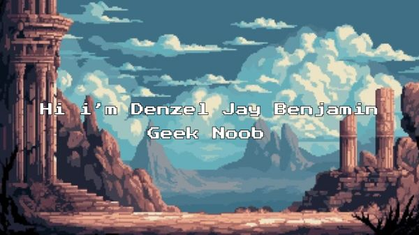

  ## 
  
  
I'm currently study in Divine Word College of Legazpi 🎓  
I love building apps, games, and helpful tools.  
Slow Learner but always growing 🌱  

### 📊 GitHub Stats

### 💻 Tech Stack

### 🔥 GitHub Streak
 

